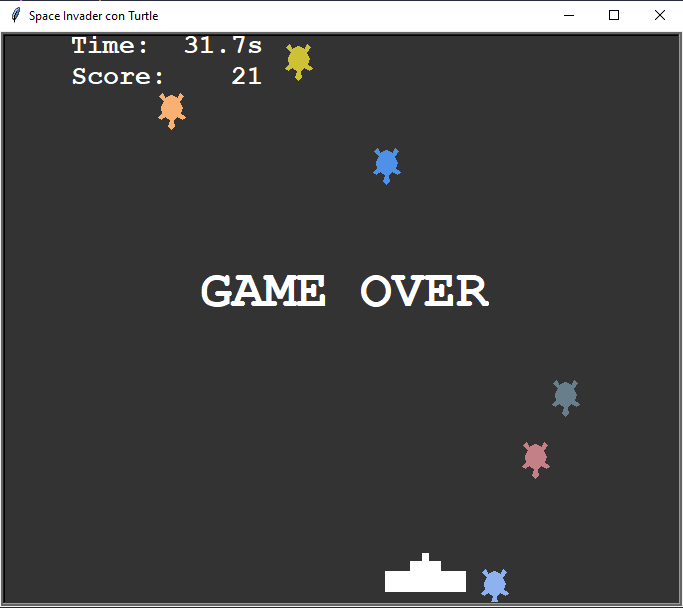

# Space Invaders con paquete Turtle

Con el objetivo de continuar aprendiendo el lenguaje Python, en esta ocasión tome un proyecto de la comunidad
"Real Python" donde explica la forma de crear el clásico juego Space Invader con la biblioteca integrada Turtle y menos de 200 líneas de código.

Este ejercicio sirve para practicar
    
- Usar el modulo Turtle para crear objetos (sprites) animados
- Crear un loop y detenerlo según cierta acción
- Utilizar funciones para realizar acciones del juego

[Fuente del proyecto](https://realpython.com/build-python-turtle-game-space-invaders-clone/#step-7-add-a-timer-and-a-score)